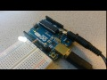
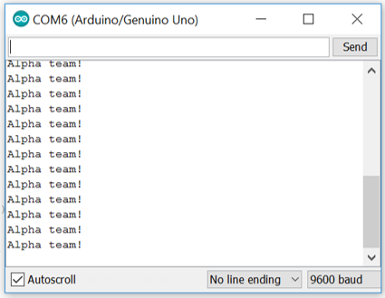
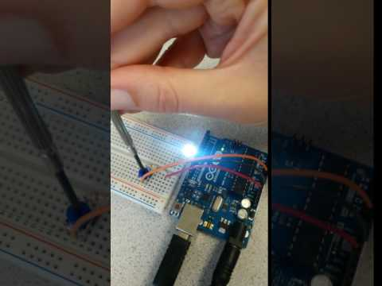
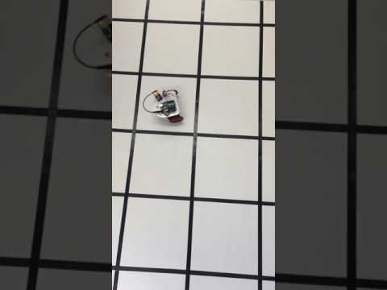

# Lab 1: Microcontrollers
## ECE 3400, Fall 2017, Team Alpha

_Goal:_

The goal of this lab was to get acquainted with the Arduino Uno microcontroller, and to build and control a basic robot. 

_Lab:_

First, we installed the Arduino IDE from this [link](https://www.arduino.cc/en/Main/Software)

Second, we tested the blink sketch on the Arduino (File->Examples->Basics->Blink):


Third, we modified it to work with an external LED, by adding these lines of code:

```C
pinMode(9, OUTPUT); //Setup pin 9 as output
digitalWrite(ledPin, HIGH); //Turn on LED
digitalWrite(ledPin, LOW); //Turn off LED
```
[](https://youtu.be/tHVKVdAuRxc)


Fourth, we communicated over serial interface:

```C
Serial.begin(9600);           //Setup serial interface to communicate with 9600 baudrate
Serial.print("Alpha team!");  //Send text 
Serial.println("");           //Carriage return
```



Fifth, we read an analog input from a potentiometer connected to A0, and used it to control the brightness of the LED:

```C
potmeter = analogRead(A0); //Reads an ADC conversion from pin A0 using default settings for the ADC (10 bit conversion).
Serial.println(potmeter);  //Send the potmeter value to the screen
analogWrite(ledPin, potmeter>>2); //The analog write function only takes 8bits, so we have to divide our value by 4
```

[](https://youtu.be/s1B5GrTkDZo)

Sixth, we controlled a continuous rotation servo-motor using the library servo.h:

```C
#include <Servo.h>  //Library
Servo myservo;      //Declare instance
myservo.attach(11); //Attach the servo input to pin 11 (set it up as a pwm output, 20Hz)
myservo.write(0);   //0 is full speed reverse, 90 no speed, 180 full speed ahead
```

Finally, we assembled our robot and made it drive in a (sorta) square. Clearly we need to tune the motor values better, and start relying on sensors to track the black lines in the future!


[](https://youtu.be/L83JydJF4H8)

_Helpful links:_

* We found the [Arduino website](http://lmgtfy.com/?q=arduino+analog+write%20Arduino%20website) to be incredibly helpful.
* Also, this [code](https://playground.arduino.cc/Main/ShowInfo) allows you to diagnose your Arduino Uno. Here, you can see how fast a clock cycle really is, how long a conversion takes, etc.
