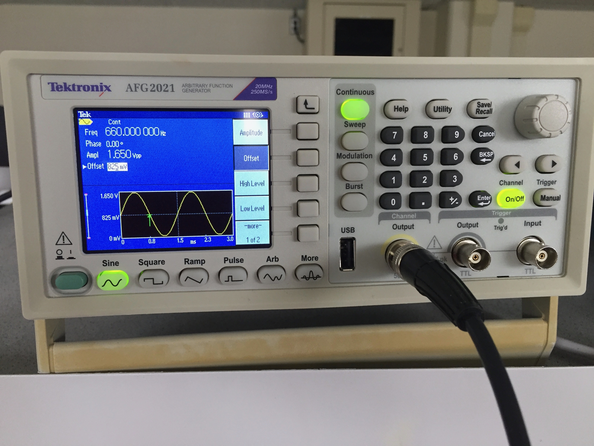
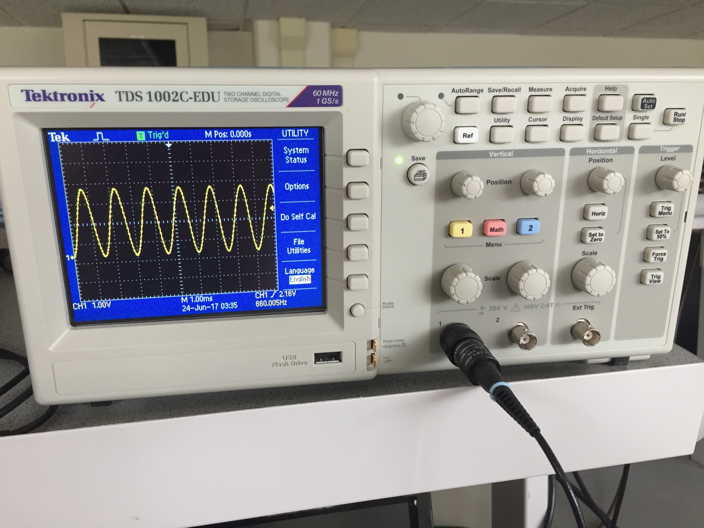
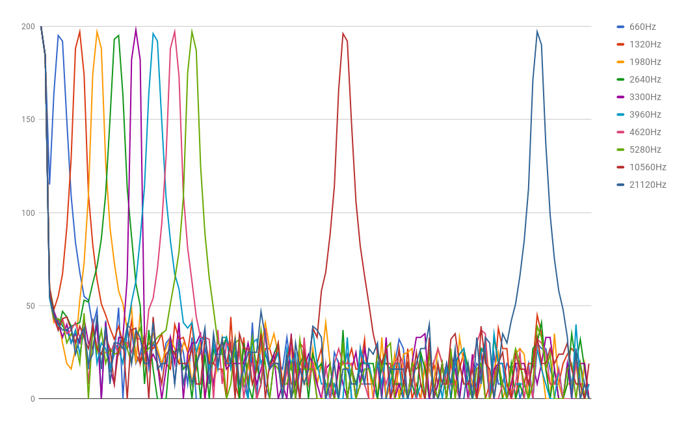
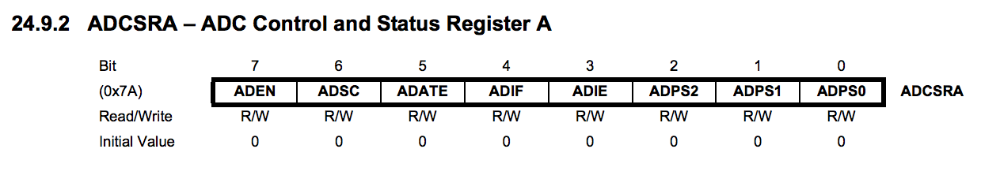
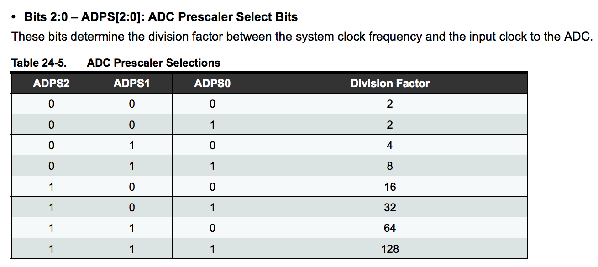
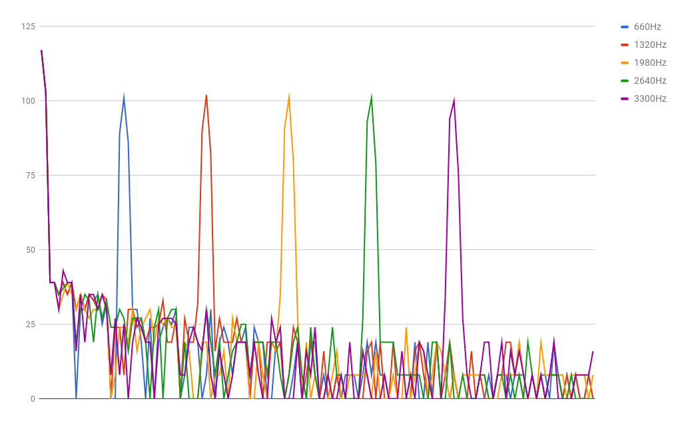

# Lab 2: Analog Circuitry and FFTs
## Team Alpha

### Goals:
- Get a Fast Fourier Transform algorithm running on the Arduino.
- Understand the Open Music Lab FFT library versus a naive library written using analogRead().

- Capture a 660Hz tone using the Electret microphone.
- Amplify the signal if necessary.
- Process the signal using a Fast Fourier Transform running on the Arduino.
- Show the expected spike in the FFT bin in the output containing 660Hz.

- Capture IR pulses from the treasure.
- Amplify the signal if necessary.
- Process the signal using a Fast Fourier Transform running on the Arduino.
- Show the expected spike in the FFT bin in the output containing the frequency set on the treasure.

### Tone generation
We found a nice [web application to generate a tone](http://www.szynalski.com/tone-generator).


### Timing ADC capture: analogRead() versus Free Running Mode
The accuracy of our FFT depends on the sampling frequency of our computation, *Fs*. Fs is determined by several factors:
- The clock speed of the Arduino. 16MHz is the default, but this can be modified.
- The clock speed of the ADC. This is a factor of the clock speed of the Arduino. The ADC clock is determined as the Arduino clock speed divided by a prescalar, which must be a power of 2.
- The number of bits captured by the ADC. The ADC grabs data off the wire in a step called a "conversion". A conversion takes more than one clock cycle. In the case of the specific Atmel chip used in this course (aka the Arduino) and its 10-bit ADC, a conversion takes 13 clock cycles.

The default configuration for the ADC clock is 125kHz. At conversion takes 13 clock cycles. Therefore the maximum sampling frequency is 125000 / 13 = **~9600Hz**.

### Free Running Mode: fft_adc_serial
The lab asked us to download the Open Music Lab FFT library. We installed this to our Arduino IDE by copying the directory into the 'libraries' folder.

We started by running the example script *fft_adc_serial*. Before jumping to sampling data from the microphone, we first tested this script using the function generator in the lab.

We set the generator to 660Hz, 1.65Vpp (3.3V/2), with a 0.825V offset (1.65V/2). These setting were confirmed using the oscilloscope.





We then captured data using the fft_adc_serial script.

This script is set to collect 256 samples for each run of the FFT. Running at a sampling frequency of 9600Hz, this gives us 9600 / 256 = 37.5Hz per bin in our FFT. 660Hz / 37.5Hz = 17.6. So we expect to see the peak for our 660Hz input to appear in the 17th bin in our output.

However, with an input of 660Hz we found an unusual result: the peak for the 660Hz tone appears in the 5th bin in our output.

One reason to use the function generator to create our input is that it makes changing that input simple. We gathered samples for integer multiples of 660Hz, first to investigate if the FFT algorithm is behaving sensibly at all (do the peaks appear in bins numbered with integer multiples of 5?) and second to get an idea of what the sample frequency, Fs, might be to produce this result.



The peak for each frequency appears in the following bins:
```
660: 5
1320: 10
1980: 14
2640: 19
3300: 23
3960: 27
4620: 32
5280: 36
10560: 71
21120: 116
```

As you can see from the graph of our output, the FFT algorithm is behaving sensibly. The integer multiples of 660Hz appear in equally spaced bins. Strangely, we are able to detect much higher frequencies than expected. According to the Nyquist sampling frequency, the highest frequency we should be able to detect is Fs/2. Yet, we can correctly discern frequencies far above 9600Hz/2.

These data suggest that we are sampling at over 40kHz. This makes sense with 660Hz appearing in the 5th bin, as 40000Hz / 256 = 156Hz. 5 * 156Hz = 780. 780 - 156 = 624Hz, so with this sampling frequency, 660Hz would indeed appear in the 5th bucket.

However, remembering that the ADC clock is set by the main clock speed divided by a power of 2, there are only a few options for the sampling frequency.  

```
16000000 / 128 = 125kHz  
125kHz / 13 = ~9600Hz  

16000000 / 64 = 250kHz  
250kHz / 13 = ~19000Hz  

16000000 / 32 = 500kHz  
500kHz / 13 = ~38kHz  
```

38kHz / 256 = 148.4Hz per bin in our FFT. This matches up well with our results. Knowing this, we have strong reason to suspect that the default settings for the ADC clock are being modified somewhere by our FFT library or by the script we are running.

Looking more closely at the fft_adc_serial script, we noticed there is an obvious suspect line:

``` C
void setup() {
  Serial.begin(115200);
  TIMSK0 = 0;
  ADCSRA = 0xe5; // <-- THIS LINE
  ADMUX = 0x40;
  DIDR0 = 0x01;
}
```

ADCSRA appears to be a register controlling the ADC. [Checking the datasheet](http://www.atmel.com/images/Atmel-8271-8-bit-AVR-Microcontroller-ATmega48A-48PA-88A-88PA-168A-168PA-328-328P_datasheet_Complete.pdf) confirms this. The datasheet allowed us to disambiguate this line and determine that the ADC clock is being adjusted by this script before the FFT is run.





The final 3 bits of ADCSRA are ADPS2, ADPS1, and ADPS0. These three bits determine the prescalar by which the main clock, running at 16MHz, is divided to get the ADC clock. 0xe5 is hexidecimal for 11100101, so the final 3 bits are 101. According to this table from the datasheet, that gives a prescalar of 32, not the default of 128! This means the ADC clock is running at 500kHz, explaining our FFT output.

Note that the datasheet also indicates that running the ADC clock this fast will lower precision: "By default, the successive approximation circuitry requires an input clock frequency between 50kHz and 200kHz to get maximum resolution. If a lower resolution than 10 bits is needed, the input clock frequency to the ADC can be higher than 200kHz to get a higher sample rate." (page 240)

However, we appear to get decent results from our script, so should the robot challenge require us to do more precise FFT processing, this approach might be a good option.

### analogRead(): fft_analogread

We modified the fft_adc_serial script to use analogRead() instead of running the ADC in free-running mode.

```C
void setup() {
  Serial.begin(115200); // use the serial port
}

void loop() {
  while(1) {
    cli();
    for (int i = 0 ; i < 512 ; i += 2) {
      fft_input[i] = analogRead(A0); // <-- NOTE THIS LINE
      fft_input[i+1] = 0;
    }
    fft_window();
    fft_reorder();
    fft_run();
    fft_mag_log();
    sei();
    Serial.println("start");
    for (byte i = 0 ; i < FFT_N/2 ; i++) {
      Serial.println(fft_log_out[i]);
    }
  }
}
```

We ran the same tests using our function generator and got a much different output than the fft_adc_serial script.



The peak for each frequency appears in the following bins:
660: 20
1320: 39
1980: 58
2640: 77
3300: 96

Obviously the sampling frequency is much lower when using analogRead(). Arduino makes available a script called [ShowInfo](https://playground.arduino.cc/Main/ShowInfo) that contains a speed test option that gives the time taken to do an analogRead().

The results for our Arduino look like:
```
Speed test
----------
F_CPU = 16000000 Hz
1/F_CPU = 0.0625 us
The next tests are runtime compensated for overhead
Interrupts are still enabled, because millis() is used for timing
  nop                       : 0.063 us
  avr gcc I/O               : 0.125 us
  Arduino digitalRead       : 3.585 us
  Arduino digitalWrite      : 4.562 us
  pinMode                   : 4.217 us
  multiply byte             : 0.632 us
  divide byte               : 5.410 us
  add byte                  : 0.569 us
  multiply integer          : 1.386 us
  divide integer            : 14.277 us
  add integer               : 0.883 us
  multiply long             : 6.102 us
  divide long               : 38.662 us
  add long                  : 1.762 us
  multiply float            : 7.487 us
  divide float              : 80.162 us
  add float                 : 9.417 us
  itoa()                    : 12.827 us
  ltoa()                    : 125.887 us
  dtostrf()                 : 80.662 us
  random()                  : 51.587 us
  y |= (1<<x)               : 0.568 us
  bitSet()                  : 0.569 us
  analogRead()              : 111.987 us
  analogWrite() PWM         : 11.197 us
  delay(1)                  : 1007.987 us
  delay(100)                : 99999.984 us
  delayMicroseconds(2)      : 0.757 us
  delayMicroseconds(5)      : 3.838 us
  delayMicroseconds(100)    : 99.337 us
-----------
```

analogRead() takes 111.987us, giving a sampling frequency of 1 / 0.000111987 = ~8930Hz. 8930Hz / 256 = 34.9Hz. This means our bins are off by ~15Hz. This could be because of variance in the time taken to conduct analogRead() or because FFT algorithm has limited precision.
