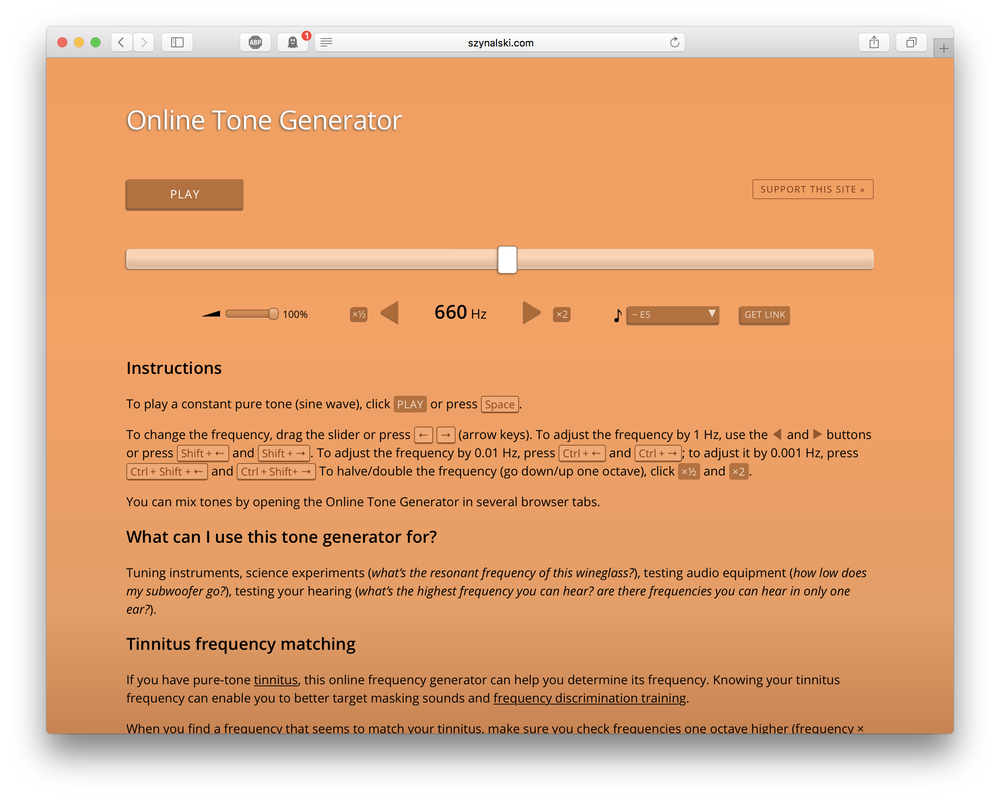

# Lab 2
## Team Alpha

Goal: Capture a 660Hz tone using the Electret microphone, amplify the signal, and process the signal using a Fast Fourier Transform running on the Arduino. Show the expected spike in the FFT bin in our output containing 660Hz.

### Tone generation
First, we found a [web application to generate a tone](http://www.szynalski.com/tone-generator).



### Timing ADC capture: analogRead() versus Free Running Mode
The accuracy of our FFT depends on the sampling frequency of our computation, Fs. Fs is determined by several factors:
- clock speed of the Arduino (16MHz is the default, but this can be modified)
- clock speed of the ADC (this is some factor of the clock speed of the Arduino which can be changed with a prescalar)
- number of bits captured by the ADC

The ADC grabs data off the wire in a step called a "conversion". A conversion takes more than one clock cycle. In the case of the specific Atmel chip (aka the Arduino) we are using for this class, a conversion takes 13 clock cycles.

We found a [good explanation of these factors](http://www.microsmart.co.za/technical/2014/03/01/advanced-arduino-adc/) and how to calculate Fs.

We timed the analogRead() function using the ShowInfo script [found on the Arduino website](https://playground.arduino.cc/Main/ShowInfo). Running the "Speed tests" option gives an output like this:

```
Speed test
----------
F_CPU = 16000000 Hz
1/F_CPU = 0.0625 us
The next tests are runtime compensated for overhead
Interrupts are still enabled, because millis() is used for timing
  nop                       : 0.063 us
  avr gcc I/O               : 0.125 us
  Arduino digitalRead       : 3.585 us
  Arduino digitalWrite      : 5.092 us
  pinMode                   : 4.217 us
  multiply byte             : 0.632 us
  divide byte               : 5.412 us
  add byte                  : 0.569 us
  multiply integer          : 1.387 us
  divide integer            : 14.277 us
  add integer               : 0.883 us
  multiply long             : 6.100 us
  divide long               : 38.687 us
  add long                  : 1.763 us
  multiply float            : 7.110 us
  divide float              : 79.962 us
  add float                 : 9.227 us
  itoa()                    : 13.397 us
  ltoa()                    : 126.487 us
  dtostrf()                 : 78.962 us
  random()                  : 51.512 us
  y |= (1<<x)               : 0.569 us
  bitSet()                  : 0.569 us
  analogRead()              : 111.987 us
  analogWrite() PWM         : 11.732 us
  delay(1)                  : 1006.987 us
  delay(100)                : 99999.984 us
  delayMicroseconds(2)      : 0.506 us
  delayMicroseconds(5)      : 3.587 us
  delayMicroseconds(100)    : 99.087 us
-----------
```

An analogRead() takes 111.987µs. This gives a frequency of 8928.5Hz.

In free running mode using the default clock settings on the Arduino (16MHz clock, 125kHz ADC clock, 13 cycle conversion) we can expect a sample rate of ~9600Hz (125000 / 13 = 9615.4).

The choice between using the built-in analogRead() function and free running mode on the ADC can result in a ~700Hz improvement in Fs. This is why the Open Music FFT samples use the free running approach.


### Open Music FFT script
We read through the example code provided with the Open Music Labs FFT library (fft_adc_serial.pde). This code interacts with the Arduino's ADC directly in "free running" mode, bypassing the interface provided by analogRead(). As shown above, this allows us to sample from the ADC faster than the analogRead().

***Note: the comments here were added by the ECE3400 TA's.***
```C
cli(); // Turn off global interrupts.
// We do not want the Arduino context switching during the sampling process to
// handle an interrupt.

// Grab 256 samples. Note that this does not reference FFT_N, defined at the top
// of the script, as it should. This is bad style and could introduce a bug, as
// this code will always take 256 samples even if FFT_N changes.
for (int i = 0 ; i < 512 ; i += 2) {
  // The ADC is controlled by writing directly to the control register, ADCSRA.
  // This allows us to avoid the overhead involved with
  // Wait for the ADC to be ready.
  while(!(ADCSRA & 0x10));
  // Restart the conversion.
  ADCSRA = 0xf5;
  // Grab the upper and lower bytes from the two ADC registers.
  // The ADC has a resolution of 10 bits, which requires two 8-bit registers.
  byte m = ADCL;
  byte j = ADCH;
  // Take the two register values and combine them to form an
  // 16-bit signed integer. This is what the FFT library expects.
  int k = (j << 8) | m;
  k -= 0x0200;
  k <<= 6;
  // Load the created signed integer into the data structure used by the FFT
  // library to perform the FFT calculation. Only use the even numbered indices.
  // The library considers the even numbered indices as the real component of the
  // inputs and the odd numbered indices as the complex component of the inputs.
  fft_input[i] = k;
  fft_input[i+1] = 0;
}
// Call the necessary functions to run the FFT.
fft_window();
fft_reorder();
fft_run();
fft_mag_log();
sei(); // Turn on global interrupts.
```


### Microphone test circuit
- Images of the circuit with amplifier


### Testing the FFT using the function generator
- Timing --> bucket math
- Function generator screen shot
- Serial output
- Explanation of the bug we found
- Graph of the serial output


### analogRead() code
- Annotated code snippet
- Timing --> bucket math
- Graph of the serial output
