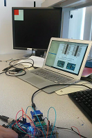

# Lab 3: Digital Logic
## Team Alpha, ECE 3400, Fall 2017

### Goal: 
This lab is divided into two. One (half-) team will take at least two external inputs to the FPGA and display them on a screen. The other team will react to an external input of their choice and output a short 'tune' consisting of at least three tones - This tone will correspond to a signal indicating that the robot is done searching the maze.

### Lab3 Team 1, Screen Driver:

We decided to connect two toggle switches and show the change in a 2-by-2 grid on the screen. Later, this code can be expanded to display the full maze. The following figure shows an overview of our system:

 

First, we declared our 2-by-2 array of bits, and switch 1 to control the x-coordinate and switch 2 to control the y-coordinate of the highlighted square: 

```verilog
//2-by-2 array of bits
reg grid_array [1:0][1:0]; //[rows][columns]
wire [1:0] grid_coord_x; //Index x into the array
wire [1:0] grid_coord_y; //Index y into the array
// current highlighted square
 wire highlighted_x;
 wire highlighted_y;	 
//Switch input through GPIO pins
 assign highlighted_x = GPIO[33];
 assign highlighted_y = GPIO[31];
```

We then made a state machine that loops through each register in the array and determines if those correspond to the position set by the switches (highlighted_x and highlighted_y):

 

```verilog

// State 0: Loop through grid
if (state == 0) begin
  if (grid_ind_x < 1) begin         //If X-coordinate is 0
    grid_ind_x <= grid_ind_x + 1;   //X-coordinate = 1
  end
  else begin                        //If X-coordinate is 1
    grid_ind_x <= 0;                //X-coordinate = 0
    if (grid_ind_y < 1) begin       //If Y-coordinate is 0
      grid_ind_y <= grid_ind_y + 1; //Y-coordinate = 1
    end
    else begin                      //else Y-coordinate = 0
      grid_ind_y <= 0;
    end
  end
  state <= 1;                       //Switch to state 1
end // state 0

// State 1: If at highlighed coordinates, set grid space to 1, else set to 0
else if (state == 1) begin
  if (grid_ind_x == highlighted_x && grid_ind_y == highlighted_y) begin
    grid_array[grid_ind_y][grid_ind_x] <= 1;
  end
  else begin
    grid_array[grid_ind_y][grid_ind_x] <= 0;
  end
  state <= 0;
end // state 1

else begin                          //Default
  state <= state;
end
```

To check our code without the screen, we first connected four of the LEDs on the FPGA board, each one representing a different position in the grid. 

```verilog
assign LED[0] = grid_array[0][0];
assign LED[1] = grid_array[0][1];
assign LED[2] = grid_array[1][0];
assign LED[3] = grid_array[1][1];
```
See a video of our system here: .

Next, we were given a VGA module to drive the screen. We read through this module carefully, and came to the conclusion that it works like the following sketch illustrates. Our job will be to modify the main module. 


First, we changed the color of the screen to green, blue, and red.

```verilog
assign PIXEL_COLOR = 8'b000_000_00 \\black
assign PIXEL_COLOR = 8'b111_000_00 \\red
assign PIXEL_COLOR = 8'b000_111_00 \\green
assign PIXEL_COLOR = 8'b000_000_11 \\blue
```
(Fyi, underscores in Verilog are ignored by the compiler, they're just there for readability!)

Second, we drew a black square on a red screen, using an if-statement in a combinatorial block: 

```verilog
always @ (*) begin 
  if(PIXEL_COORD_X < 10'd64 && PIXEL_COORD_Y < 10'd64) begin
    PIXEL_COLOR = 8'b000_000_00;
  end
  else begin
    PIXEL_COLOR = 8'b111_000_00;
  end
end
```
The signal inside the bracket is called a sensitivity list. An asterix means that the block will run when any of the signals inside change. We are comparing our 10-bit pixel coordinates to constants. These constants are defined as 10-bits (10), decimal value (d), 64.

Third, we want to draw four boxes on the screen and color them dependent on the values in our array (0 for not highlighted, and 1 for highlighted). 

To accomplish this, we must first have some way of determining if the current pixel output by the VGA driver is in the grid, and if so, what square it is in. In order to create modularity in our code, we decided to write a new module that we could instantiate in our top-level module. The module takes in the current x- and y- coordinates from the VGA driver and outputs a 0 or 1 according to the grid space it is in, OR a 2 if the pixel is simply not in the grid. This module is shown below. 

```verilog
`define GRID_TOP_LEFT_X 0   //Potential offset from the corner
`define GRID_TOP_LEFT_Y 0   //Potential offset from the corner
`define BLOCK_SIZE      64  //Each block will be 64 by 64 pixels

module VGACOORD_2_GRIDCOORD(
  vga_pixel_x,  
  vga_pixel_y,
  grid_coord_x,
  grid_coord_y
  );  //Specify all inputs and outputs to the module

  input  [9:0] vga_pixel_x;   //Specify the direction and number of bits in the signal
  input  [9:0] vga_pixel_y;
  output reg [1:0] grid_coord_x;
  output reg [1:0] grid_coord_y;
  
  always @ (*) begin          //begin combinatorial logic to determine which block the pixel is in
    if (vga_pixel_x < `BLOCK_SIZE && vga_pixel_y < `BLOCK_SIZE) begin               //Upper left block
      grid_coord_x = 0;
      grid_coord_y = 0;
    end
    else if (vga_pixel_x < `BLOCK_SIZE && vga_pixel_y < `BLOCK_SIZE * 2) begin      //Lower left block
      grid_coord_x = 0;
      grid_coord_y = 1;
    end
    else if (vga_pixel_x < `BLOCK_SIZE * 2 && vga_pixel_y < `BLOCK_SIZE) begin      //Uper right block
      grid_coord_x = 1;
      grid_coord_y = 0;
    end
    else if (vga_pixel_x < `BLOCK_SIZE * 2 && vga_pixel_y < `BLOCK_SIZE * 2) begin  //Lower right block
      grid_coord_x = 1;
      grid_coord_y = 1;
    end
    else begin                                                                      //Not in the grid
      grid_coord_x = 2;                                               
      grid_coord_y = 2; 
    end
  end
\
endmodule
```

Now we change the main module to instantiate our module and set a color according to the grid coordinate of the current pixel.

```verilog

VGACOORD_2_GRIDCOORD vgacoord_2_gridcoord(    //Instantiate module
  .vga_pixel_x(PIXEL_COORD_X),                //The text after the periods refers to internal wires in the module
  .vga_pixel_y(PIXEL_COORD_Y),                //The text in the parantheses refers to wires external to the module
  .grid_coord_x(grid_coord_x),
  .grid_coord_y(grid_coord_y)
  );

//Always run:
if (grid_coord_x < 2 && grid_coord_y < 2) begin                                   //If within grid
  if (grid_array[grid_coord_y][grid_coord_x] == 1) begin                          //If array reads 1, color square red
    PIXEL_COLOR <= 8'b111_000_00;
  end
  else begin
    PIXEL_COLOR <= 8'b111_111_11;
  end
  else begin
    PIXEL_COLOR <= 9'b000_000_00;
  end
end
```
 


Finally, we merged our code so that the switches toggled the state of the screen. Check out the video here:

[](https://youtu.be/KMW1bO6gJTg)


### Lab 3 Team 2: Sound generation

First, we began by implementing the most basic sound wave - a square wave. We chose to generate a 440Hz wave and output this to  GPIO pin. For this, we wrote a simple state machine to increment a counter and output a pulse based on the value of that counter. Generating a wave of a certain frequency requires considering the frequency that our state machine is clocked at and choosing a counter value based on that to give us our desired frequency. The state machine clock is 25MHz, which means the period of the 440Hz wave will be approximately 56818 cycles (25MHz/440Hz) of the state machine clock period. In other words, square pulse must toggle every 25MHz/440Hz/2 cycles. The code to achieve that as well as a picture of our 440Hz square wave shown below.

```verilog
// Local parameter
localparam CLKDIVIDER_440 = 25000000/440/2;

// Sound variables
reg square_440;                       // 440 Hz square wave
assign GPIO[0] = square_440;
reg [15:0] counter;

// Sound state machine
always @ (posedge CLOCK_25) begin
  if (counter == 0) begin
    counter    <= CLKDIVIDER_440 - 1; // reset clock
    square_440 <= ~square_440;        // toggle the square pulse
  end
  else begin
    counter    <= counter - 1;
    square_440 <= square_440;
  end
end	
```
 

We were able to generate a tone using a simple square wave, but for more pleasant sounding tones, we also tried generating a triangle wave and a sine wave. For these waves, we used an [8-bit R2R DAC](http://www.bourns.com/docs/Product-Datasheets/R2R.pdf) to take an 8-bit digital output from the FPGA and convert this into analog voltages that can be played through generic speakers. 

**Claire TODO: take picture of circuit and insert here**

To generate the output for a triangle wave of 440Hz, we incremented and decremented an 8-bit counter (from 0 to 255) every 110 cycles. Using the same line of thinking as for the square wave, we knew that we wanted one cycle of our wave to go from 0 to 255 to 0 in 56818 25MHz clock cycles. From here, we reasoned that the counter must increment or decrement every 110 cycles in order to go from 0 to 255 to 0 in the desired number of clock cycles. Below is a picture of our generated triangle wave, as well as the state machine to increment the counter.

 

```verilog
  reg  [7:0] tri_value;       // 8-bit wave-output counter        
   reg [6:0] tri_incrementer; // another counter to determine when the wave-output counter should incrementer/decrement
   reg       count_direction; // 0 for increment, 1 for decrement

// Triangle wave generator state machine
   always @ (posedge CLOCK_25) begin
    if (reset) begin
      tri_value <= 8'b0;
      tri_incrementer <= 7'b0;
      count_direction <= 1'b0;
    end
    
    // Determine if counter should increment or decrement
    if (tri_value == 0) begin
      count_direction <= 1'b0;
    end
    else if (tri_value == 8'd255) begin
      count_direction <= 1'b1;
    end
    else begin
      count_direction <= count_direction;
    end
    
    // Increment/decrement tri_value every 110 cycles
    if (tri_incrementer == 7'd110) begin
       if (count_direction == 1'b1) begin
        tri_value <= tri_value - 1;
       end
       else begin
        tri_value <= tri_value + 1;
       end
       tri_incrementer <= 0;
    end
    else begin
      tri_incrementer <= tri_incrementer + 1;
    end   
   end // always @ (posedge CLOCK_25)
```

The easiest way to generate a sine wave in Verilog is to initialize a sine table in ROM and then iterate through these values to produced the frequency you desire. This technique is known as direct digital synthesis (DDS) - if you take ECE4760, you'll learn more about this from Bruce! Generating a table containing data points that form a sine wave by hand is painful, so we used Matlab to that for us. We then copied and pasted that generated table directly from a .txt file created by Matlab to a Verilog module. To create a Verilog module that Quartus can infer as a ROM block, we used a template provided by Quartus. Inferring a memory block like ROM means that when the HDL is synthesized on the FPGA, Quartus will know to use the chip's memory bits to create a standardized ROM architecture. 

To learn more about inferring memory architecture and using templates in Quartus, check out this link: [Recommended HDL coding styles](https://people.ece.cornell.edu/land/courses/ece5760/DE1_SOC/HDL_style_qts_qii51007.pdf). 

Below is our sine table ROM module, which is based off the Quartus template. We then iteratively output values from this table to generate our sine wave, which is also shown in an image below.

```verilog
module SINE_ROM
(
  input [9:0] addr,
  input clk, 
  output reg [7:0] q
);

  // Declare the ROM variable
  reg [7:0] sine[628:0];

  initial
  begin
     sine[0] <= 8'b10000000;
     //... remaining contents of sine table//
     sine[628] <= 8'b10000000;
  end

  // Read from requested address of ROM
  always @ (posedge clk)
  begin
    q <= sine[addr];
  end
```

 

After all of this experimentation, we finally decided that the sine wave produced the most pleasant sounding timbre - so we chose to create our 3-pitch tune by using three sine waves of different frequencies. We wanted our basic tune to consist of three consecutive notes, each played for one second. We chose to represent a 'done' signal with an on-board switch; the tune would play when one of the switches on the FPGA was switched on. To generate the tune, we used two additional counters: one to keep track of the duration of each note and one to keep track of how many notes have been played. To make the top-level code easier to read, we moved the sine-generation state machine to a separate module which chooses a counter value based on the desired frequency. Below is the code snippet used to generate our three-note tune.

```verilog
  // tune generation state machine
  always @ (posedge CLOCK_25) begin
    if (reset) begin
      enable_sound <= 0;
      tone_duration_counter <= 0;
      tone_number_counter <= 0;
      sound_freq <= 10'd440;
    end
    if (~SW[3]) begin
      if (tone_number_counter == 0) begin
        enable_sound <= 1;
        sound_freq   <= 10'd262; // middle c

        // play tone for one second
        if (tone_duration_counter == `ONE_SEC) begin
          tone_duration_counter <= 0;
          tone_number_counter   <= tone_number_counter + 1;
        end
        else begin
          tone_duration_counter <= tone_duration_counter + 1;
        end
      end //0th tone
      else if (tone_number_counter == 1) begin
        enable_sound <= 1;
        sound_freq   <= 10'd330; // middle e
        
        // play tone for one second
        if (tone_duration_counter == `ONE_SEC) begin
          tone_duration_counter <= 0;
          tone_number_counter   <= tone_number_counter + 1;
        end
        else begin
          tone_duration_counter <= tone_duration_counter + 1;
        end
      end //1st tone
      else if (tone_number_counter == 2) begin
        enable_sound <= 1;
        sound_freq   <= 10'd392; // middle g
        
        // play tone for one second
        if (tone_duration_counter == `ONE_SEC) begin
          tone_duration_counter <= 0;
          tone_number_counter   <= tone_number_counter + 1;
        end
        else begin
          tone_duration_counter <= tone_duration_counter + 1;
        end
      end //2nd tone
      else begin
        enable_sound <= 0;   // done playing tune, so disable sound 
      end
    end
    else begin
      enable_sound <= 0;
      sound_freq <= 10'd440;
    end
  end //always @ (posedge clk)
```
### Concluding Remarks:

Finally, we have to think about how this will work for our final system. We will have to display the full maze on the screen, including treasures, walls, unknown and travelled areas, and the robot itself. We also need to be able to display when the robot has finished traversing the maze.  Here are the questions we discussed:

* How will we display the maze? Do we stick with a similar array approach to hold the state of each grid space?
* Will it still make sense to use parallel communication between the Arduino and the FPGA when you include all the states? How many bits total will we need to convey all the information at every new location?
* Standardized coordinate system. How do we display the coordinates on the screen? How does the robot think about the maze as it travels? The standard way to interpret images and screens is to place the origin in the upmost left corner, making the positive x direction towards the right, and the positive y-direction downwards. 

### Great links:

* Very useful links with code examples: http://www.fpga4fun.com/
