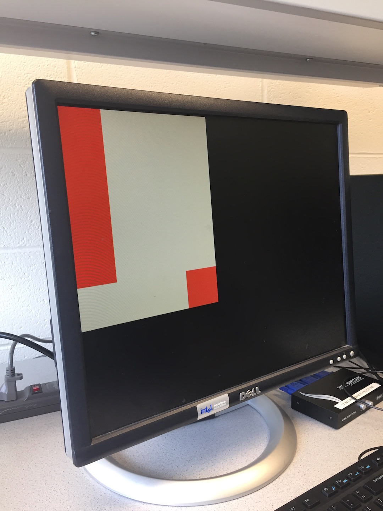
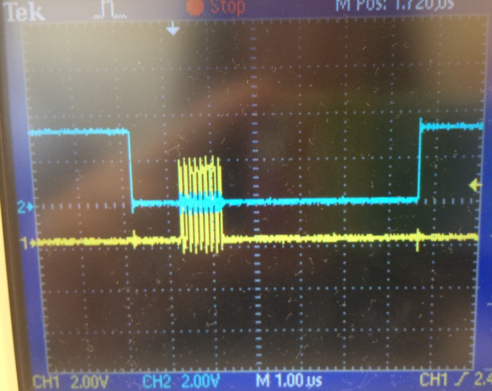
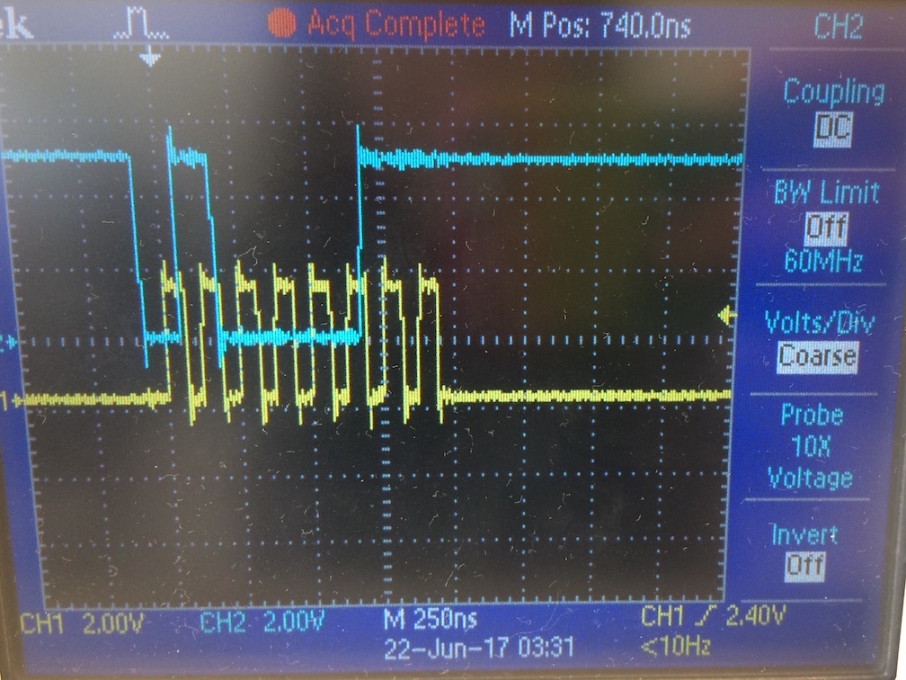

# Lab 4
## Team Alpha

Note: This lab requires two Arduinos powered on simultaneously. It is fine to have two Arduinos connected to the same PC, but you will only be able to talk to one over the serial monitor at a time in the Arduino IDE. Change between the two by choosing between the two ports in the Tools --> Port menu.

## Radio

### Hardware

First we handled the hardware:
- Download the radio library and install with the Arduino IDE.
  https://github.com/maniacbug/RF24
- Download the GettingStarted example from the lab4 course repository.
- We skippped soldering two radio headers as there were already complete versions in the lab.
- Found two radios.
- Found two Arduinos.
- Plugged the radios into the Arduinos along with the 3.3V wire.


### Software: Getting Started

Then we handled the software for GettingStarted:
- Set the two channel numbers for our team according to the formula given in the lab handout.

``` C
// Radio pipe addresses for the 2 nodes to communicate.
const uint64_t pipes[2] = { 0x0000000002LL, 0x0000000003LL };
```

- Program both Arduinos with the GettingStarted example.
- Plug both Arduinos into the PC simultaneously. Use the serial monitor to set one to transmit mode and confirm that it says it is sending messages. Switch to the other on the serial monitor to see if it is receiving these messages.

### Software: Sending the Maze

We chose to send each position in the maze as a character. According the documentation for the radio library, the default payload size is 32 bytes, so we have more than enough room to send 25 characters for our 5 x 5 maze. We can send the entire maze as a single payload.

[Note: The original lab writeup does not appear to consider this option and assumes every character will be sent as its own payload.]

***Defining the maze:***
``` C
//
// Maze
//
unsigned char maze[5][5] =
{
  3, 3, 3, 3, 3,
  3, 1, 1, 1, 3,
  3, 2, 0, 1, 2,
  3, 1, 3, 1, 3,
  3, 0, 3, 1, 0
};
```

***Sender side:***
``` C
// Send the maze in a single payload
printf("Now sending the maze!\n");
bool ok = radio.write( maze, sizeof(maze) );

if (ok)
  printf("ok...");
else
  printf("failed.\n\r");

// Now, continue listening
radio.startListening();
```

***Receiver side:***
``` C
unsigned char got_maze[5][5];
bool done = false;
while (!done)
{
  // Fetch the payload.
  done = radio.read( got_maze, sizeof(got_maze) );

  // Print the maze
  for (int i=0; i < 5; i++) {
    for (int j=0; j < 5; j++) {
      printf("%d ", got_maze[i][j]);
    }
    printf("\n");
  }

  // Delay just a little bit to let the other unit
  // make the transition to receiver
  delay(20);

}
```

Because the radio library implements Acks behind the scenes (this is handled by radio.write()), we do not need to manually acknowledge received packets.

A different approach to sending the data, say splitting it over multiple payloads, would require a state machine to resend un-Acked packets.

### Software: Sending New Data

We want to send three pieces of information, the x-coordinate, the y-coordinate, and the state of the current position. Because our maze is 5 x 5, we need 3 bits for each coordinate. Only four values are possible for the state of the current position: unvisited, no wall, wall, and treasure. Hence we need 2 bits for the state.

This gives us 8 bits of data, which can be packed into a single byte. (Note: the default payload size is 32 bytes, so to actually reduce the # of bytes sent by the radio requires changing this setting.)

We pack our byte using a bit shifting scheme and send it in a single payload. It is unpacked on the receiver side using masking along with bit shifting.

***Sender side:***
```C
unsigned char new_data;
// Pack the bits in this pattern
// x_coord | y_coord | data
// 3 bits  | 3 bits  | 2 bits
// This scheme supports a maze up to 8 x 8

// Test data
unsigned char x_coord = 4;
unsigned char y_coord = 4;
unsigned char pos_data = 3;

// Use bit shifting to pack the bits
// For deployment with a robot, something like this should be factored out into
// a function, along with the code to unpack the bits
new_data = x_coord << 5 | y_coord << 2 | pos_data;
// For the test case of (5, 5, 3) the byte shoud look like: 10010011
// In decimal this is 147

// Take the time, and send it.  This will block until complete
printf("Now sending new map data\n");
bool ok = radio.write( &new_data, sizeof(unsigned char) );

if (ok)
  printf("ok...");
else
  printf("failed.\n\r");

// Now, continue listening
radio.startListening();
```

In binary this packed character looks like 10010011. In decimal notation this is 147. We can easily check on the receiver side that the right byte is being received by taking advantage of this.

***Receiver side:***
```C
unsigned char got_data;
bool done = false;
while (!done)
{
  // Fetch the payload, and see if this was the last one.
  done = radio.read( &got_data, sizeof(unsigned char) );

  // Spew it
  // Print the received data as a decimal
  printf("Got payload %d...",got_data);

  // Delay just a little bit to let the other unit
  // make the transition to receiver
  delay(20);

}

// First, stop listening so we can talk
radio.stopListening();
```

If our code is correct, this will print: ```Got payload 147...```

## FPGA

We followed the steps suggested in the lab handout and were able to receive the robot's current location from the Arduino and display this as well as the previous position on the VGA monitor. We were able to accomplish the first step of making the grid larger relatively quickly, as our code from lab 3 was easily scaled-up. 



Next, after some brainstorming, we decided to use SPI rather than the parallel method of communcation we chose to implement in lab 3. Even though the parallel method is much simpler to implement, we weighed the pros and cons of each method and decided that SPI makes more sense when transmitting packets that are several bits long. SPI is the most complex part of our FPGA design since it requires working with two clocks: the FPGA 25MHz system clock and the SPI clock. All of the VGA drawing is clocked on the system clock, while data on the SPI MOSI line comes in with SCLK. We needed to find some way of synchronizing these two clocks to read packets correctly.  

The best way getting outut to aid in debugging FPGA code is to output signals to GPIO signals and probe them with a scope. Using a scope to view signals helped us immensely in the process of writing a functional SPI unit, as it allowed us to completely understand how SPI signals from the Arduino behave and how our signals were responding. First, we probed the SPI signals from the Arduino: SCLK, MOSI, and Chip select (CS). The images below show SCLK as well as both the CS (top image) and MOSI (bottom image) lines (we couldn't view all these signals at once since the scopes in lab only have 2 inputs). The most notable thing we learned from probing the signals is that the SCLK signal is _NOT_ always on; if you send one 8-bit packet, there will only be 8 SCLK cycles. This will be important to keep in mind when writing your SPI code.

SCLK (yellow) and CS (blue)


SCLK (yellow) and MOSI (blue)


Since SCLK only happens when packets are being transmitted, we thought that sampling SCLK using the FPGA clock would be the best way to synchronize all the SPI signals with the system clock. _Note: This sampling implemenation only works because we know the SPI clock is slower than the FPGA clock._ We use shift registers (clocked on the FPGA clock) to hold the history of all three SPI signals. By storing the recent history of SCLK, we are able to detect a rising edges. When CS is low (CS is active-low), we sample the MOSI line on every rising SCLK edge. We know the packet is complete when we've read in 8-bits. We then parse the valid packet into x-coordinate and y-coordinate values, and use these to change the state of the corresonding index in our grid array.

** INSERT VIDEO HERE ** 

The final part of this lab was to mark all previously-visited on the grid. To achieve this, we needed to implement some way for the state machine to remember the previous coordinates of the robot. We chose to use an additional register to hold this information. Every time the robot moved coordinates, the previous coordinate register would update. We also needed to modify the grid array to hold an additonal bit of information: whether or not the grid space had been visited. Our grid array now held 2 bits of information. We used the previous-coordinate information to update the grid array everytime the robot moved. We didn't need to change the way we displayed our maze grid at all; we simply added an additional line of logic to draw any previously-visited squares as green, rather than white.

The video below shows the final deliverable for this lab: coordinates being sent from the Arduino to the FPGA via SPI and the robot's current and previous locations being displayed on the screen.

**INSERT VIDEO HERE**     
