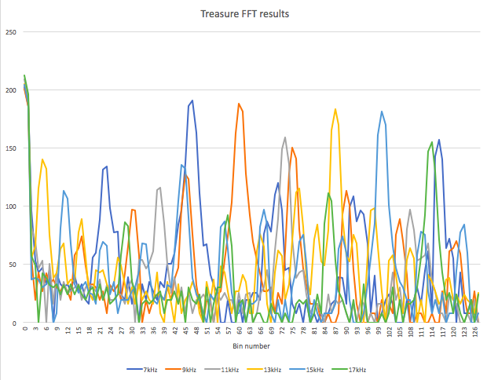
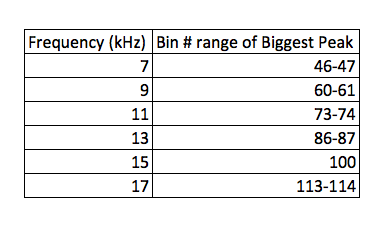

# ECE 3400, Fall'17: Team Alpha

*By Claire Chen, June 20th*

## Milestone 2: Treasure Detection

* Fortunately, we got our treasure detection working really well in lab 2. Recall this graph with the FFT analysis of 5 different treasures ranging from 7kHz to 17kHz:

Using this data, we wrote simple code to determine the treasure frequencies based on where the peaks for each frequency occured. The table below shows the bin numbers that the biggest peak occurs in for each frequency in a more readable format. 

